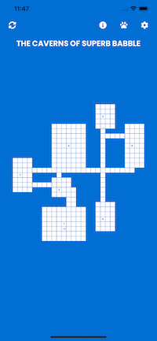
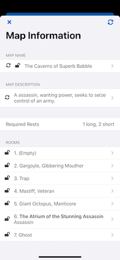
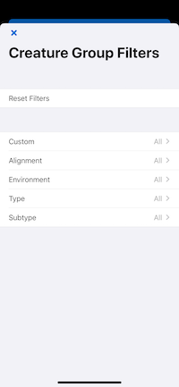

# App Of Mapping

  

The App of Mapping was forged by learned hands deep in the scent-laden cavern of a humble Dungeon Master on a quest to automate dungeon and encounter creation with a magical tool for all comrade DMs. Many foes emerged while casting the App of Mapping, but in the end, good prevailed over evil to bring forth an app that randomly generates clean looking maps with a retro feel and detailed 5e-based encounters, all with the simple touch of a button. DMing will never be the same after the App of Mapping ushers in the bright dawn of a new era. Or actually DMing will likely stay the same, but just be easier with a handy app. Only the slow, noble churning of time within the multiverse will tell.

TL;DR: This app helps DMs create cool dungeons.

Features:

- Highly customizable encounters
- Boss encounters
- Traps
- Random (and customizable) encounter name
- Random (and customizable) map name
- Random (and customizable) map description
- Customizable encounter notes
- Party member character import from D&D Beyond (not really working anymore)
- Homebrew monster import
- Group monsters by alignment, type, subtype & environment
- Create custom monster groups
- Balanced treasure generation
- Elite party scaling factor
- Scale difficulty by max boss CR
- Specify max number of rooms
- View typical rests required for dungeon (short/long)
- Importing/Exporting of maps
- Importing/Exporting of encounters